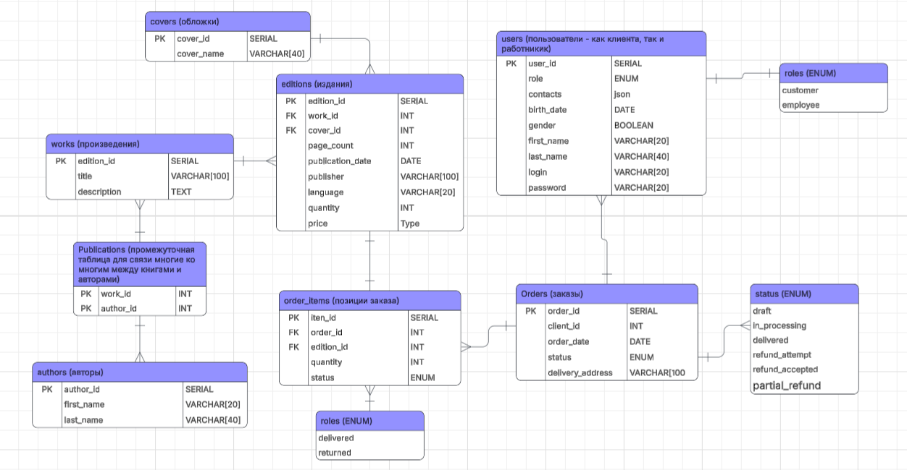

Описание страниц:

У каждой страницы шапка состоит из:
* Кнопка Главная
* Кнопка Каталог
* Кнопка для перехода в Личный кабинет/ перехода на страницу для Входа/Регистрации

Главная страница:
* Кнопка перехода в каталог с пояснением, что заказать книги можно через каталог
* Кнопка перехода в Личный Кабинет с пояснением, что изменить информацию о себе, посмотреть свои заказы или оформить возврат, если с момента доставки заказа прошло не больше недели
* Контанкты для связи

Каталог книг:
* Список 50 самых популярных книг (Название, авторы, цена, издатель, язык)
* Кнопка показать ещё
* При нажатии на запись о книге происходит переход на страницу описание книги (сверху в каталоге будет пояснение об этом)
* Поиск и фильтры по названию, автору, жанру, цене, дате издания

Страница книги:
* Название, описание, характеристики (Название, авторы, цена, издательство, язык, тип обложки, дата издания, количество на складе)
* Фото книги
* Кнопка для заказа
* Кнопка добавить в корзину (для пользоватлея есть корзина, которая находится в личном кабинете и которая является заказом со статусом draft и видна в списке заказов)

Страница Входа/Регистрации:
Форма слева для ввода логина и пароля + кнопка войти, Форма справа для регистрации: ввести имя, фамилию, номер телефона и почту, логин и пароль + кнопка зарегистрироваться

Личный кабинет:
* Форма с личными данными, которые можно менять и кнопка сохранить изменения
* Список заказов (id, дата, адрес доставки, статус) (первым отдельно от остальных идет корзина), для каждого заказа можно нажать на запись, чтобы перейти на старницу заказа

Станица заказа:
* Информация о позициях (название, авторы, издательство, цена, количество, статус позиции, при нажатии на кнопку подробнее о позиции перекидывает на страницу подробнее о книге)
* Справа от каждой позиции есть чекбокс
* Если это корзина, то есть кнопка Оформить заказ, и можно убрать галочку от товаров, которые не войдут в итоговый заказ
* Если это уже полученный заказ, то есть кнопка оформить возврат, и можно выставить галочки для позиций, которые подлежат возврату
* Подсчитывается итоговая стоимость

Следующие страницы доступны только работникам магазина:

Панель управления работника:
* Кнопка Список книг
* Кнопка список заказов

Страница список книг: (Название, авторы, цена, издательство, язык, тип обложки, дата издания, количество на складе, можно менять все кроме авторов)
* Содержит те же фильтры, что и Каталог
* Каждая запись содержит характеристики книги
* Можно менять характеристики книги, добавлять и удалять книги 

Страница список заказов: (id заказа, статус, адрес доставки, id клиента, его имя, фамилия и контактная информация)
* Записи о всех заказах клиентов
* Можно менять статус заказа, есть фильтры по статусу, дате, клиенту

Описание use cases/сценариев использования:

Клиент:
* Выбор и добавление книги в корзину : Клиент заходит на сайт и попадает на главную страницу сайта. Оттуда он заходит в каталог книг, ишет с помощью поиска и фильтров нужные книги в каталоге, переходит на страницу книги, которая его заинтересовала, и нажимает на кнопку добавить в корзину (для добавления клиент должен быть залогинен, иначе его перекинет на страницу входа/регистрации).
* Регистрация/Вход в личный кабинет: На Главной, нажав на кнопку вход/регистрации или Личный Кабинет (если клиент еще не залогинен) клиент попадет на страницу Вход/Регистрация
* Редактирование данных: В Личном кабинете будет форма для изменения всех данных клиента, которая показывает текущие данные клиента, для сохранения изменений нужно нажать кнопку Сохранить изменения
* Просмотр заказов и оформление возврата:  В Личном кабинете клиент видит список заказов и может посмотреть подробности о конкретном заказе, перейдя на страницу Подробности о заказе при нажатии на запись о заказе. На этой странице он может оформить возврат для части позиций, поставив галочки в чекбоксы, соответствуюшие этим товарам, и нажав кнопку Оформить возврат.
* Оформление заказа: В Личном кабинете клиент может перейти в Корзину (корзина находится первой в списке заказов и имеет статус draft). Это перенесет его на страницу Подробности о заказе, и он сможет оформить заказ, нажав кнопку Оформить заказ и поставив галочки в чекбоксы для позиций, которые в итоге он хочет взять

Работник:
* Вход: На Главной нажимает на кнопку Вход/Регистрация, попадает на страницу Вход/Регистрация. После авторизации попадает на страницу Панель управления работника. * Просмотр и редактирования информации о книгах: После авторизации работник находится на странице Панель управления работника, после нажатия на кнопку список книг попадает на страницу список книг, где может добавлять новые книги, изменять информацию о существующих и удалять их.
* Просмотр и изменени статуса заказа: После авторизации работник находится на странице Панель управления работника, после нажатия на кнопку список заказов попадает на страницу список заказов, где может менять статус заказов с помощью нажатия на кнопку изменить статус (например, одобрение возврата (статус refund_accepted), сообщение о готовности заказа и доставке заказа (статус delivered))
* Подтверждение возврата: В списке заказов, после нажатия на запись заказа работник попадает на страницу Подробности о заказе, где отметив нужные позиции и нажав на кнопку Подтвердить возврат он может одобрить возврат части позиций.

Схема БД:

