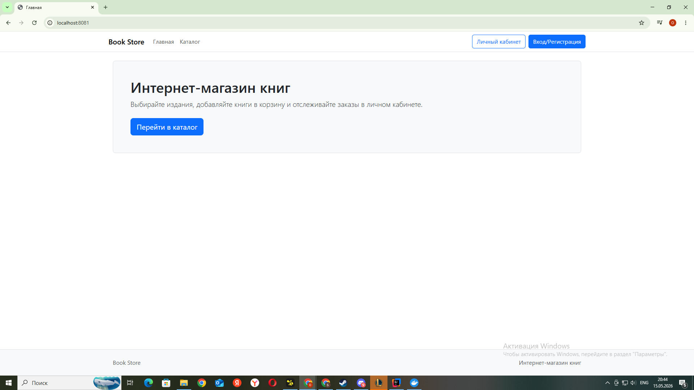
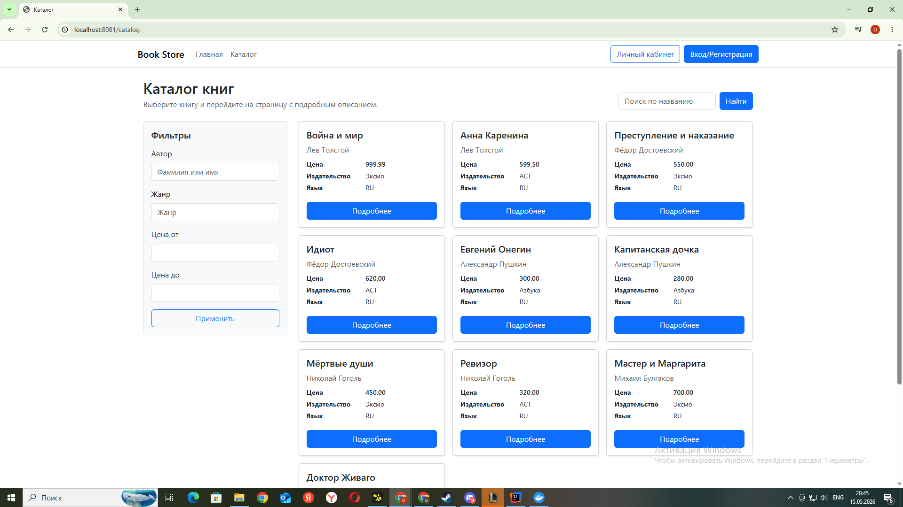
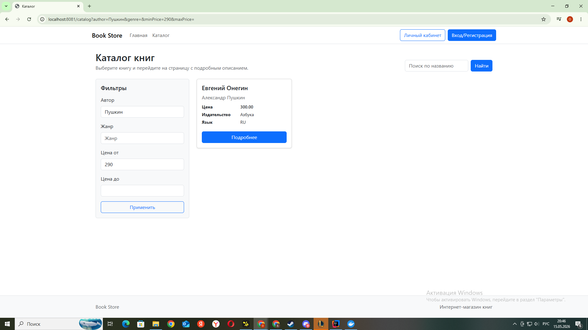
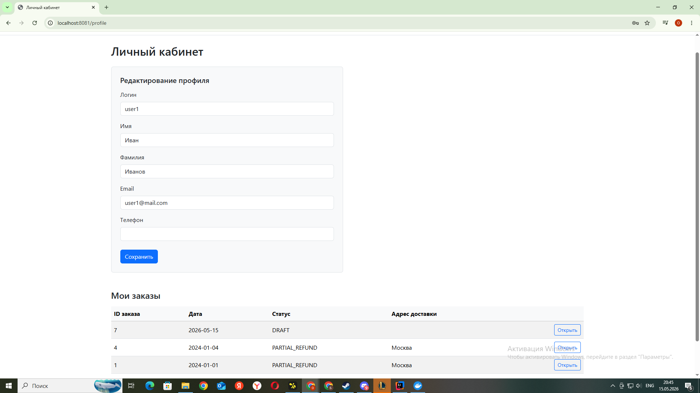
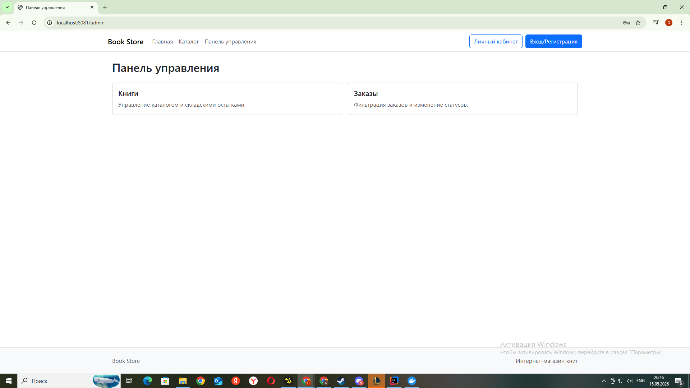
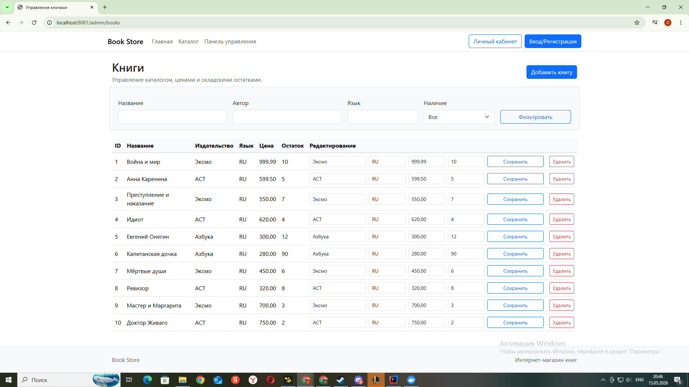
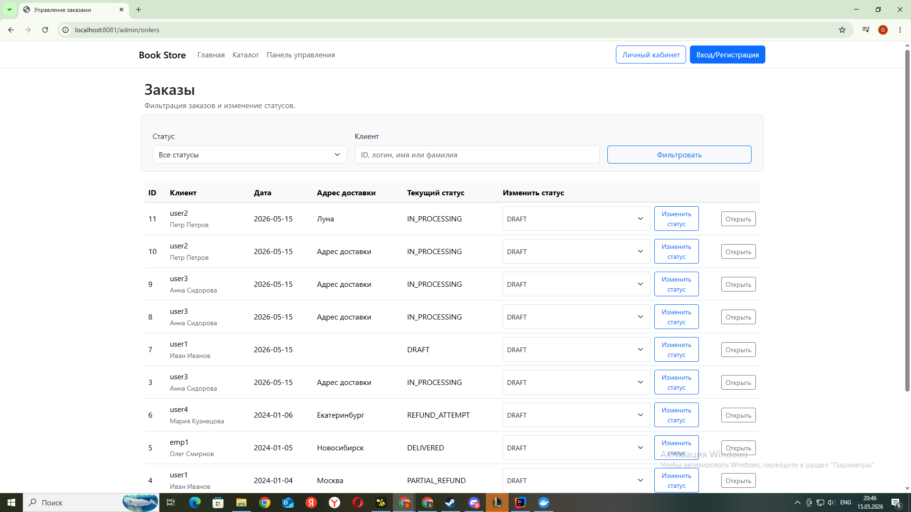
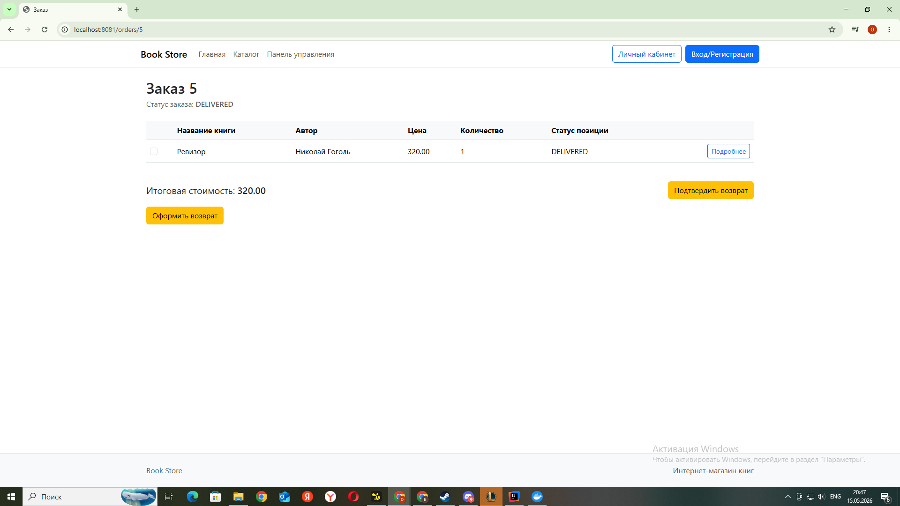

# Веб-интерфейс проекта Book Store

# Главная страница

Главная страница интернет-магазина книг.  
Является точкой входа в приложение и содержит базовую навигацию по системе.

## Основные элементы:
- логотип и название магазина `Book Store`
- навигационное меню:
  - Главная
  - Каталог
- кнопки:
  - Личный кабинет
  - Вход/Регистрация
- приветственный блок с описанием функциональности сайта
- кнопка перехода в каталог книг

---

# Каталог книг

## Общий каталог

Страница отображения каталога книг.

## Основные элементы:
- список карточек книг
- информация о каждой книге:
  - название
  - автор
  - цена
  - издательство
  - язык
- кнопка «Подробнее»
- форма поиска по названию
- панель фильтрации:
  - автор
  - жанр
  - минимальная цена
  - максимальная цена

---

## Каталог с применёнными фильтрами

Страница демонстрирует работу системы фильтрации каталога.

### Использованные фильтры:
- автор: Пушкин
- минимальная цена: 290

### Результат фильтрации
На странице отображается только книга:
- «Евгений Онегин»

---

# Клиентская часть

## Личный кабинет пользователя

Страница личного кабинета пользователя.

## Основные разделы

### Редактирование профиля
Форма содержит:
- логин
- имя
- фамилию
- email
- телефон

### Мои заказы
Таблица заказов содержит:
- ID заказа
- дату
- статус
- адрес доставки
- кнопку открытия заказа

### Назначение страницы
Личный кабинет позволяет:
- управлять персональными данными
- просматривать историю заказов
- отслеживать статусы заказов

---

# Панель работника

## Главная страница панели управления

Главная страница административной панели.

### Основные разделы:
- управление книгами
- управление заказами

---

## Управление книгами

Страница администрирования каталога книг.

### Основные возможности:
- просмотр списка книг
- изменение:
  - издательства
  - языка
  - цены
  - количества на складе
- сохранение изменений
- удаление книги
- добавление новой книги
- фильтрация каталога

---

## Управление заказами

Страница управления заказами пользователей.

### Основные возможности:
- просмотр всех заказов
- фильтрация:
  - по статусу
  - по клиенту
- изменение статуса заказа
- открытие подробной информации о заказе

---

## Возврат заказа

Страница обработки возврата товара.

### Основные элементы:
- номер заказа
- статус заказа
- список книг в заказе
- стоимость заказа
- кнопки:
  - оформить возврат
  - подтвердить возврат

### Назначение страницы
Используется для:
- оформления возврата товара
- подтверждения возврата сотрудником
- контроля статусов возврата
